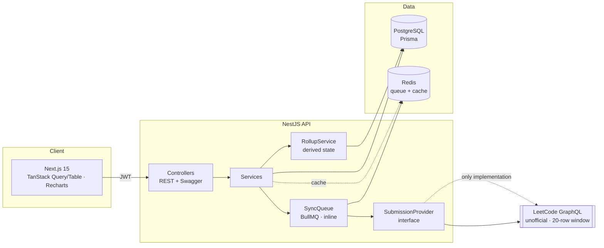
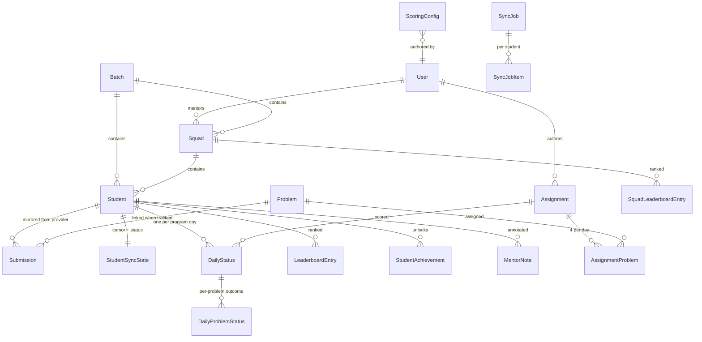
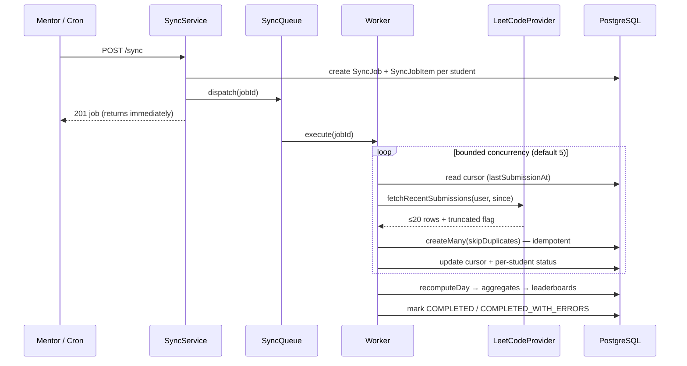

# Architecture

## System shape



The dotted edge is the point of the whole design: **`SubmissionProvider` is the only
seam through which LeetCode enters the system.** Business logic depends on the
interface, never on the vendor.

## Data model



### Source of truth vs. derived cache

| Source of truth | Derived (rebuildable) |
|---|---|
| `Submission` — every submission ever observed | `DailyStatus`, `DailyProblemStatus` |
| `Assignment` + `AssignmentProblem` | `LeaderboardEntry`, `SquadLeaderboardEntry` |
| `ScoringConfig` | `Student.currentStreak / longestStreak / totalScore / totalSolved` |
| `Student`, `Squad`, `Batch`, `User` | Achievements, levels, heatmaps, all analytics |

`RollupService.recomputeRange(from, to)` rebuilds the entire right column from the left
one. Nothing on the right is ever the only copy of a fact, which is what makes an
editable scoring formula and "Recalculate scores" safe.

The one exception is a mentor's **manual override**: `DailyStatus.isOverridden` makes a
row authoritative, and recomputation skips it rather than silently undoing a deliberate
correction.

### The three student metrics

These are separate quantities and must never be substituted for one another. Each has
exactly one implementation — `StudentMetricsService` (`modules/scoring`), over pure
rules in `@dsa/shared` — so the dashboard, daily/email report, student details,
leaderboards and analytics cannot disagree about the same student.

| Metric | Means | Does **not** mean |
|---|---|---|
| **Total LeetCode solved** (`calculateStudentLeetcodeTotalSolved`) | Lifetime *distinct* problems the student has ever solved | Assignment completion, accepted-submission rows, or anything about today |
| **Assignment completion** (`calculateAssignmentCompletion`) | Distinct assigned problems accepted within the day's window, as X/Y | Total LeetCode output |
| **DSA streak** (`calculateStudentDsaStreak`) | Consecutive *assignment* days with ≥1 assigned problem solved | Consecutive days with any LeetCode activity |

Three rules are load-bearing and non-obvious:

1. **Assignment completion looks backwards.** Assignments are often published a day or
   two after students have started, so completion searches
   `[D - ASSIGNMENT_LOOKBACK_DAYS, D]` in program-local days, not `D` alone. Matching
   `submission.dayKey === assignment.dayKey` recorded genuinely-solved problems as
   missed, which is the defect this replaced.
2. **A streak needs one problem, not all four.** `streakQualification` defaults to
   `AT_LEAST_ONE`. Requiring the whole assignment scored a 3-of-4 day identically to a
   0-of-4 day. `isPerfectDay` stays "solved everything" and is deliberately a separate
   function, so relaxing the streak bar cannot relabel partial days as perfect.
3. **Lifetime solved reconciles two sources.** The submission mirror is a *floor* — the
   provider only exposes the 20 most recent submissions, so history before a student's
   first sync was never observable. The larger of the mirror's distinct count and the
   provider profile's lifetime total is used, so neither a cold mirror nor a stale
   profile can understate the figure.

## The sync path



**Incremental by cursor.** Each student's `lastSubmissionAt` bounds the request, so a
cycle transfers only what is new regardless of how long they have been enrolled — one
provider call per student per cycle.

**Idempotent.** The unique index on `(studentId, provider, providerSubmissionId)` plus
`skipDuplicates` means re-running a sync writes nothing new and can never double-count.
`(studentId, dayKey)` does the same for `DailyStatus`.

**Failure is isolated.** One student's failure is recorded against that student and the
run continues. A job never throws its way out — one bad username must not cost the other
249 their daily report.

**The cursor advances from data, not the clock.** It is set from the newest submission
actually observed, so anything submitted *during* the sync is picked up next cycle
instead of being skipped.

## Provider abstraction

```ts
interface SubmissionProvider {
  readonly name: string;
  fetchRecentSubmissions(username, options): Promise<ProviderSubmissionPage>;
  fetchSolvedProblems(username, options): Promise<ProviderSubmissionPage>;
  fetchSubmission(username, problemSlug): Promise<ProviderSubmission | null>;
  fetchUserProfile(username): Promise<ProviderUserProfile>;
  fetchProblemMetadata(problemSlug): Promise<ProviderProblemMetadata>;
  healthCheck(): Promise<boolean>;
}
```

Two properties are in the *contract* rather than the implementation, because they are
properties of the problem and not of one vendor:

- `ProviderSubmissionPage.truncated` — the window may have been cut off. Any provider
  scraping a public feed has this; callers must handle it.
- `runtime` / `memory` are `string | null`. Callers may not require them.

Failures are a typed taxonomy (`ProviderUserNotFoundError`, `ProviderRateLimitedError`,
…), each carrying the `SyncStatus` it records as and whether it is worth retrying. A
misspelled username is never retried; a timeout is. That distinction is what keeps a
retry budget from being consumed by 12 permanently-broken usernames.

Two implementations ship: `LeetCodeProvider` and `FakeSubmissionProvider`. The fake is
not a stub — it reproduces the 20-row window, truncation, and every failure mode, so the
sync engine and scoring can be tested end-to-end with no network.

## Request pipeline

```
Request
  → Helmet · CORS · compression
  → JwtAuthGuard      (global; @Public() opts out)
  → RolesGuard        (ADMIN satisfies everything implicitly)
  → ThrottlerGuard    (global limit; tighter on /auth/login)
  → ValidationPipe    (whitelist + forbidNonWhitelisted + transform)
  → Controller → Service → Prisma
  → AuditInterceptor  (writes only on success)
  → AllExceptionsFilter (uniform envelope; never leaks internals)
```

Authentication is **global with opt-out**, so forgetting a decorator on a new endpoint
fails closed rather than open.

## Caching and degradation

`CacheService` prefers Redis and falls back to a bounded in-process LRU when Redis is
unreachable, flipping back automatically on recovery. A Redis outage should make the
dashboard slower, not take the platform down in front of a mentor. Invalidation is by
prefix using `SCAN` (never `KEYS`, which blocks the Redis event loop).

## Timezone handling

`packages/shared/src/domain/time.ts` holds the pure maths; `ProgramTimeService` binds it
to the configured zone. Submissions are bucketed into a `dayKey` **once, at write time**,
so day queries are indexed string comparisons rather than per-row timezone arithmetic.
Day-boundary queries additionally assert the UTC bounds, which guards against a stale
`dayKey` written under a previously-configured timezone.

Non-DST and DST zones are both covered by tests, including a 23-hour spring-forward day.

## Testing

- **`packages/shared`** — 103 unit tests over the parts where correctness actually
  lives: day bucketing across DST and midnight boundaries, the canonical scoring table,
  bonus tiering, streak rules (in-progress today, neutral non-assignment days), ranking
  tiebreaks and tie detection, squad aggregation, level/XP inversion, achievements.
- **`apps/api`** — the fake provider makes the sync engine testable without a network.
- **Live contract** — `npm run smoke:provider -w @dsa/api` asserts LeetCode's actual
  behaviour and is the first thing to run when numbers look wrong.
